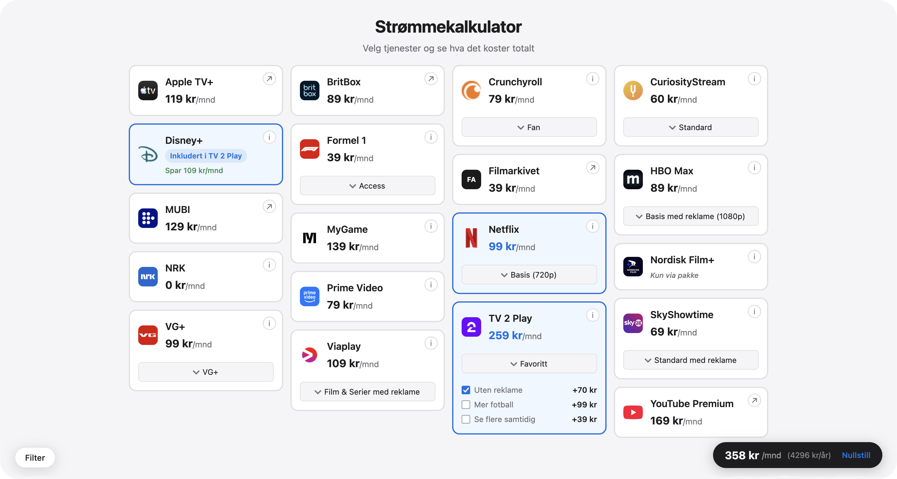

# Strømmekalkulator

Calculator for Norwegian streaming services. Pick services, tiers, and add-ons and see the monthly and yearly total.

Not affiliated with any of the providers. Prices are best-effort and may be out of date; always check with the provider before subscribing.

## Features

- Monthly and yearly total for any combination of services
- Sports filter (football, winter sports, tennis, Formel 1, etc.)
- Current selection is encoded in the URL hash, so the link is shareable
- Vanilla HTML, CSS, and JS. No build step, no dependencies

## Data

Prices live in `data.json`. Each service has a `lastChecked` date that I bump manually when I verify prices; the footer's "Sist oppdatert" label follows the most recent date across all services. Exchange rates for non-NOK prices live in `exchange-rate.json` and are refreshed monthly by a GitHub Action.
